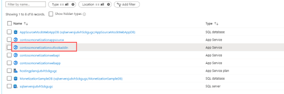
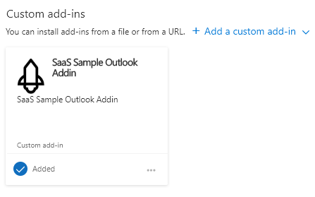
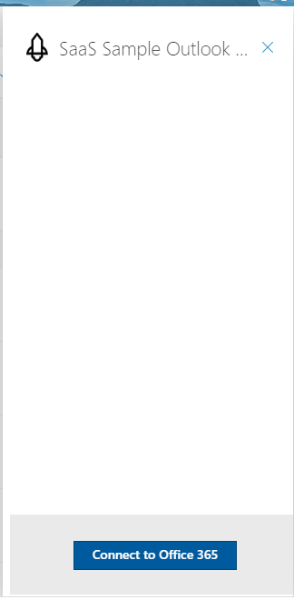

# Monetization Outlook Add-In

## Installation

1. Open the Monetization Resource Group in the Azure Portal.

2. Copy the Outlook Add-In Web Site URL.

   

3. Download the latest Manifest [Add-in Manifest xml files](OutlookWebAddInManifest.xml).

4. Open the Add-in Manifest xml file, and replace https://contosomonetizationoutlookaddin.azurewebsites.net with the URL you copied on step 2 above, then save the file.

5. In a web browswer, go to https://outlook.office.com/mail/inbox and login to your account.

6. Click **New Message**.

   

7. Click **…**.

   

8. Click **Get Add-ins**.

   

9. Click the **My add-ins** tab.

   

10. Click **Add a custom add-in->Add from file**.

    

11. Click **Install**.

    

12. The Add-In after a successfull install.

    

13. Return to the new message edit view and click **…**.

    

14. Click **Sass Sample Outlook Addin**.

    

15. Click **Connect to Office 365**.

    

16. Click **Allow** and login to your account.

    

17. Observe your license status.

    

18. Open the browser Developer console (F12), to view the DEBUG logs.

    
