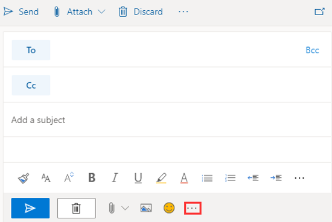
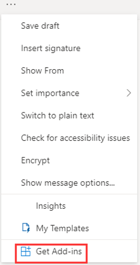
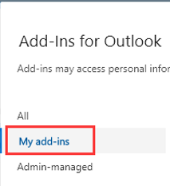
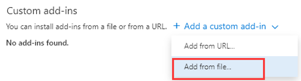
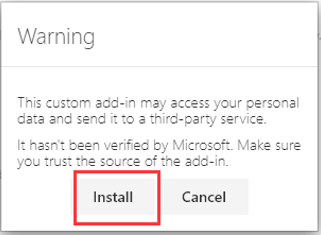
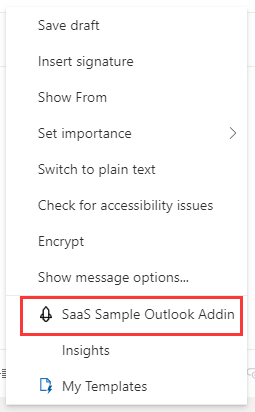
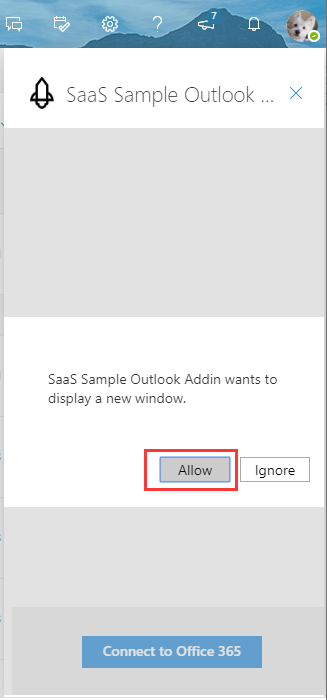
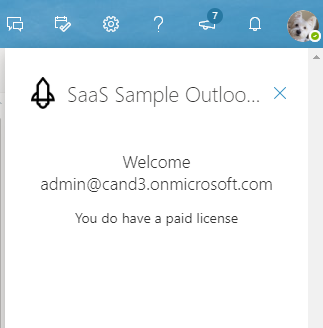

# Monetization Outlook Add-In

## Installation

1. Open the Monetization Resource Group in the Azure portal.

2. Copy the Outlook add-in website URL.

   

3. Download the latest manifest [Add-in Manifest xml files](OutlookAddInManifest.xml).

4. Open the add-in manifest XML file, replace **https://OutlookAddinSiteUrl** with the URL you copied in step 2, and then save the file.

5. In a web browser, go to https://outlook.office.com/mail/inbox and sign in to your account.

6. Click **New Message**.

   

7. Click **…**.

   

8. Click **Get Add-ins**.

   

9. Click the **My add-ins** tab.

   

10. Click **Add a custom add-in->Add from file**.

    

11. Click **Install**.

    

12. The add-in after a successful install.

    

13. Return to the new message edit view and click **…**.

    

14. Click **Sass Sample Outlook Addin**.

    

15. Click **Connect to Office 365**.

16. Click **Allow** and sign in to your account.

    

17. Use the admin account to sign in and consent.

    

18. View your license status.

    

19. Open the browser Developer console (F12) to view the DEBUG logs.

    
