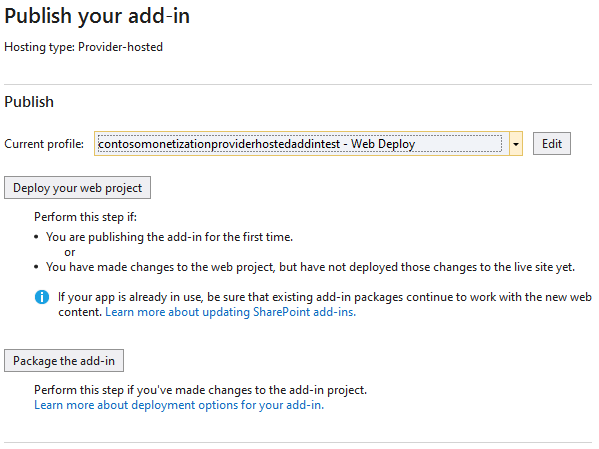
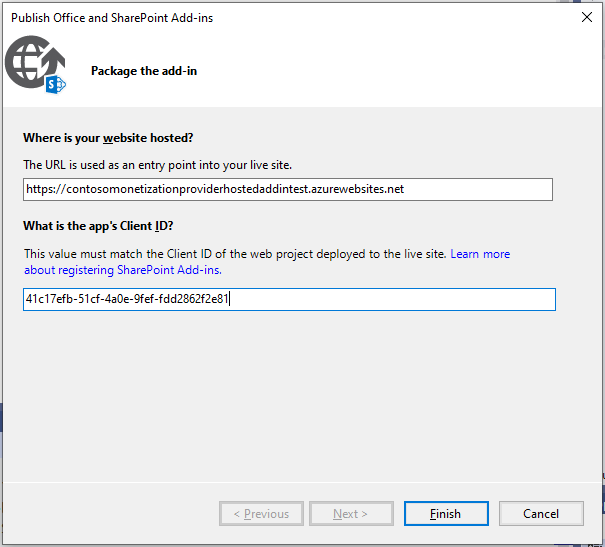
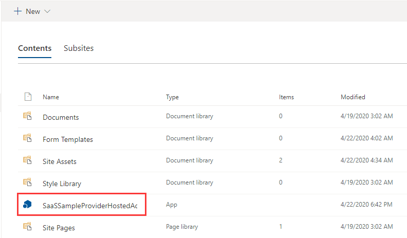
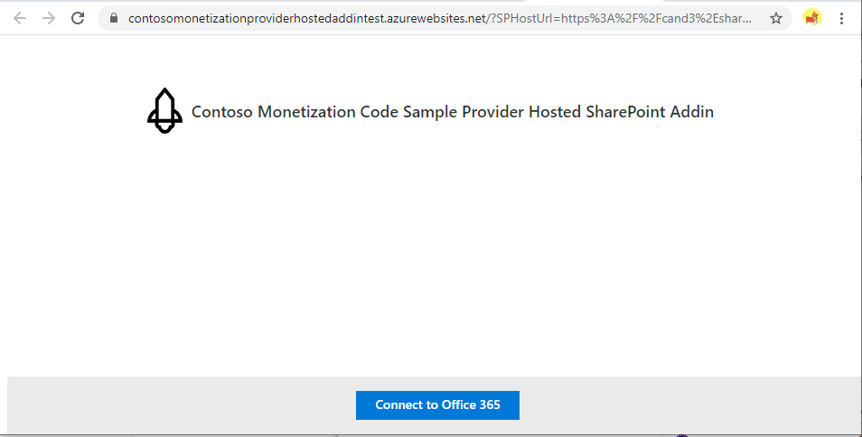
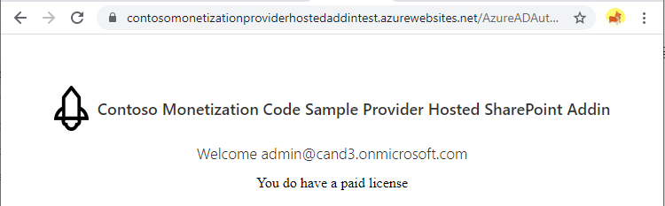

# Monetization Provider-Hosted SharePoint Add-In

## Installation

1. Firstly according [Provider-Hosted Add-in Web Site Guide](./ProviderHostedWebSiteDeploymentGuide.md) to deploy Provider-hosted add-in web site server code.

1. Open the **MonetizationCodeSample** solution with Visual Studio.

1. Select the **ProviderHostedAddIn** project, right click it, and select **Publish**.

1. Click **Package the add-in**.

   

1. Enter the Provider Hosted add-in web site **URL** and **Add-in ID**, then click **Finish** button.  This will create package file named **ProviderHostedAddIn.app**.

   

1. Go to the SharePoint App Catalog site, and click **Apps for SharePoint**.

1. Upload the **ProviderHostedAddIn.app** file.

1. Go to the Sharepoint site collection that you registered your SharePoint Add-in.

1. Open **Site contents**, click **+ New** -> **App**

1. Select **SaaSSampleProviderHostedAddin** and add it.

   

1. Click the app, and it will go to the Provier Hosted web site.

   

1. Click **Connect to Office 365**.

1. Use the admin account to sign in and consent.

   

1. View your license status.

   

1. Open the browser Developer console (F12) to view the DEBUG logs.

   
