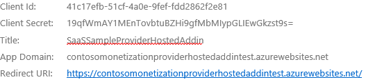
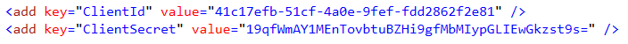
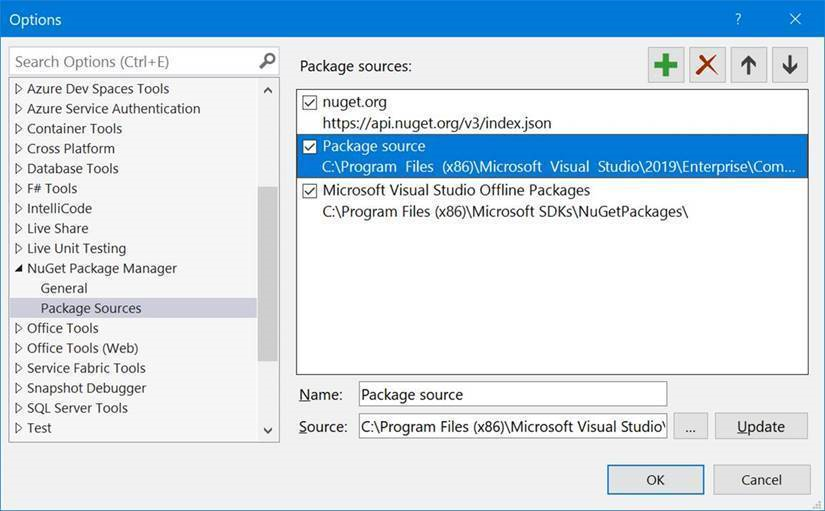
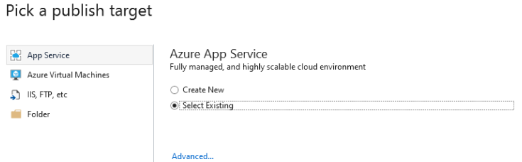
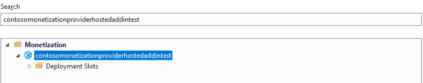

# Monetization Provider-Hosted Web Site

## Installation

1. Register your Provider-Hosted SharePoint add-in in Azure ACS by using the AppRegNew.aspx page, and retrieve the registration **Add-in ID** and **Add-in Secret** information. See [Register SharePoint Add-ins](https://docs.microsoft.com/en-us/sharepoint/dev/sp-add-ins/register-sharepoint-add-ins) for more information.

   

1. Open the Monetization Resource Group in the Azure portal.

1. Copy the Provider-Hosted Website URL.

1. Open the **MonetizationCodeSample** solution with Visual Studio.

1. In the **ProviderHostedAddInWeb** project, open the **Web.config** file.

1. Replace the **ClientId/ClientSecret** values with the **Add-in ID** and **Add-in Secret** values that you retrieved in step 1.

   

1. Select the **ProviderHostedAddInWeb** project, right click it, and select **Publish**.

   > **_NOTE:_**
   >
   > If you find below error
   >
   > NuGet Package restore failed for project ProviderHostedAddInWeb: Unable to find version '4.0.0' of package 'AppForSharePointOnlineWebToolkit'.  C:\Program Files (x86)\Microsoft SDKs\NuGetPackages\: Package 'AppForSharePointOnlineWebToolkit.4.0.0' is not found on source 'C:\Program Files (x86)\Microsoft SDKs\NuGetPackages\'. 'https://api.nuget.org/v3/index.json': Package 'AppForSharePointOnlineWebToolkit.4.0.0' is not found on source 'https://api.nuget.org/v3/index.json'.. Please see Error List window for detailed warnings and errors.
   >
   > Update the NuGet package Source
   >
   > 

1. Select **Existing Service**, then click **Create Profile**.

   

1. Select the Provider Hosted add-in web site, and click **OK**.

   

1. Click **Publish**.  The Provider Hosted SharePoint add-in web site will be published successfully.
