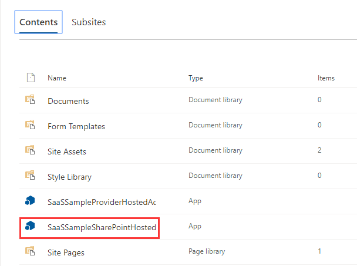
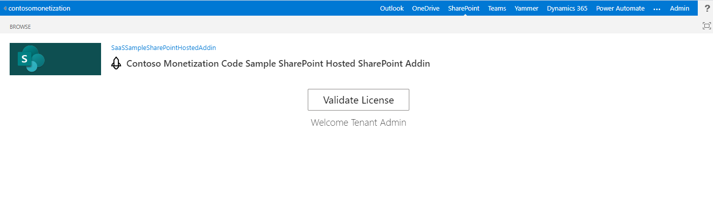
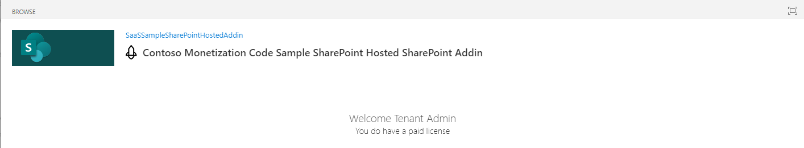

# Monetization SharePoint-Hosted SharePoint Add-In

## Installation

1. Open the **MonetizationCodeSample** solution with Visual Studio.

1. Select the **SharePointHostedAddIn** project.

1. Expand **Scripts**, and open the **app.js** file.

1. Replace the **&lt;SaaSWebAppUrl&gt;** placeholder value with the **Contoso Monetization Code Sample Web App** URL, replace the **&lt;SaaSWebAPIUrl&gt;** Web API URL placeholder valie with the **Contoso Monetization Code Sample Web API** URL, then save the file.

        const endpointConfig = {
            //Monetization Code Sample Web App
            SaaSWeb: "https://<SaaSWebAppUrl>",

            //Monetization Code Sample Web API
            SaaSAPI: "https://<SaaSWebAPIUrl>/api/Subscriptions/CheckOrActivateLicense",
            OfferID: "contoso_o365_addin"
        };

1. Right click the project and select **Publish**.

1. Click **Package the add-in**.

1. Go to the SharePoint App Catalog site where you would like to install the Add-in, then select **Apps for SharePoint**.

1. Upload the **SharePointHostedAddIn.app** file.

1. Go to the SharePoint site collection where you would like to install the Add-in. Open **Site contents**, click **+ New** -> **App**.

1. Select the **SaaSSampleSharePointHostedAddin** and add it.

    

1. Open the app, then click the **Validate License** button.

    > **Note**
    > If you are testing your SharePoint Addin in Incognito mode – you might face below error Uncaught

        DOMException: Failed to read the 'localStorage' property from 'Window': Access is denied for this document.
        at a (https://alcdn.msauth.net/lib/1.3.1/js/msal.min.js:17:98940)
        at new a (https://alcdn.msauth.net/lib/1.3.1/js/msal.min.js:17:97534)
        at new h (https://alcdn.msauth.net/lib/1.3.1/js/msal.min.js:17:74354)
        at https://luckycontosomonetizationwebapp.azurewebsites.net/home/SPHostedAddinEmbedContent?loginHint=admin@m365devsub.onmicrosoft.com:37:30

    > Please allow cookies in your Incognito Browser.

    

1. View the license status.

    

1. Open the browser Developer console (F12), to view the DEBUG logs.

    
