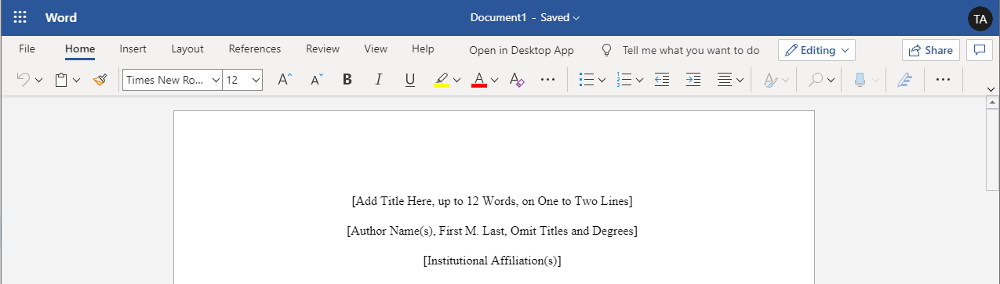
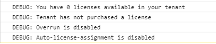

# Monetization Word Add-In

## Installation

1. Open the Monetization Resource Group in the Azure portal.

2. Copy the Word add-in website URL.

   

3. Download the latest manifest [Add-in Manifest xml files](WordAddInManifest.xml).

4. Open the add-in manifest XML file, replace **https://WordAddinSiteUrl** with the URL you copied in step 2, and then save the file.

5. In a web browser, open Word Online.

   

6. Click **Insert -> Add-ins**.

7. Click **Manage My Add-ins -> Upload My Add-in**.

   

8. Select the manifest file, and click **Upload**.

9. Click **Home -> ... **

   

10. Click **SaaS Sample Word Addin**.

11. Click **Connect to Office 365**.

12. Click **Allow** and sign in to your account.

    

13. Use the admin account to sign in and consent.

    

14. View your license status.

    

15. Open the browser Developer console (F12) to view the DEBUG logs.

    

    
