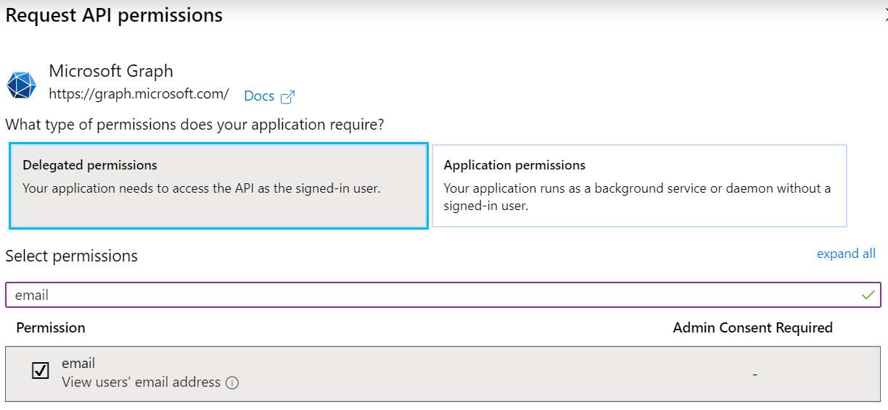
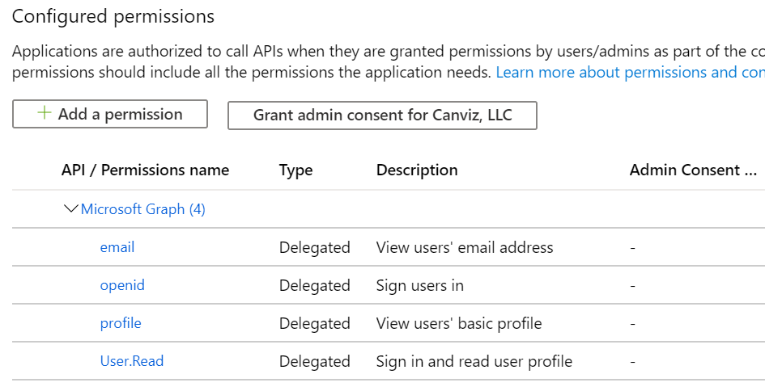
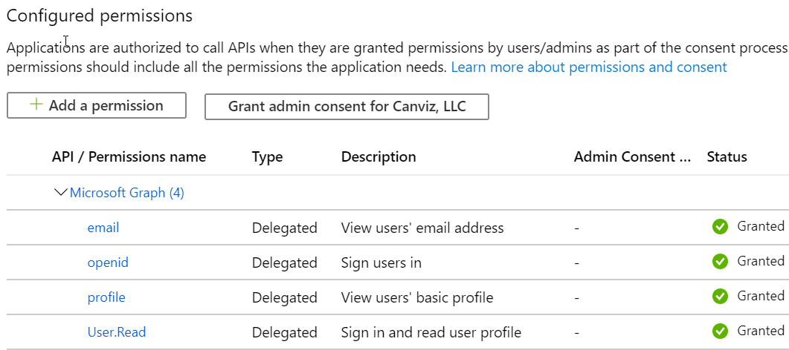

# Create sample app source Azure AD application

1. Sign in to your Azure account through the Azure portal.
1. Click **Azure Active Directory**.
1. Click **App registrations**.
1. Click **New registration**.
1. Name the application **Contoso Monetization Code Sample App Source Dev**. 
1. In the Supported account types section, select **Accounts in any organizational directory (Any Azure AD directory - Multitenant)**.
1. In the Redirect URI section, add the below URI keeping **Web** Selected.
1. Enter the following Web Redirect URIs:
	`https://localhost:44381/signin-oidc`
	`https://localhost:44381/`
1. Click **Register**.
1. Click **Authentication**.
1. In the **Implicit grant and Hybrid Flows** section, check the **ID tokens** checkbox.
1. Click **Save**.
1. Click **API permissions**.
1. Click **Microsoft Graph**.
1. In the search box, enter the **name** of each permission in the list below, then check the **checkbox** next to it, and finally click **Update permissions**.

	**Note:** The following example shows this with the **email** permission.

	

1. Repeat the process until all of the permissions in this list are added:
	
	- email
	- openid
	- profile	

	

1. Click **Grand admin consent for YOUR TENANT NAME**.
1. Click **Yes**.

When you're finished, the screen will indicate that all permissions have been granted.

