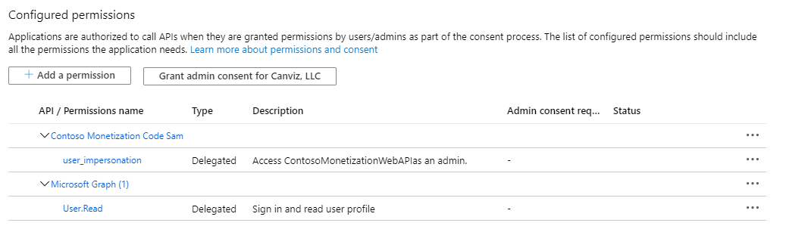

# Create sample PowerPoint add-in Azure AD application

1. Sign in to your Azure Account through the Azure portal.
1. Click **Azure Active Directory**.
1. Click **App registrations**.
1. Click **New registration**.
1. Name the application **Contoso Monetization Code Sample PowerPoint Addin Dev**. 
1. In the Supported account types section, select **Accounts in any organizational directory (Any Azure AD directory - Multitenant)**.
1. Click **Register**.
1. Click **API permissions**.
1. Click **Add a permission**.
1. Click **APIs my organization uses**.
1. In the list, select **Contoso Monetization Code Sample Web API Dev**. 
1. In the **What type of permissions does your application require?** section, select **Delegated permissions**.
1. Check the **checkbox** next to **user_impersonation**.
1. Click **Add permissions**. 

	

