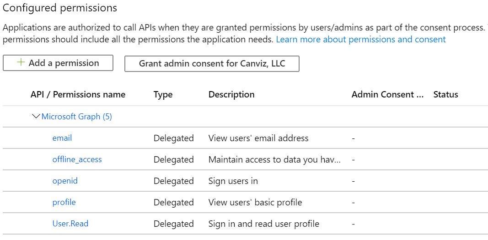
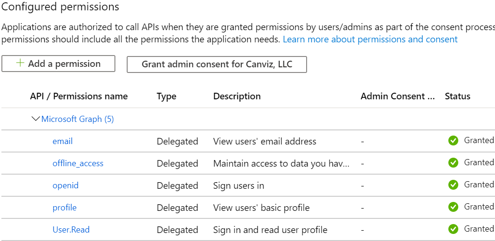
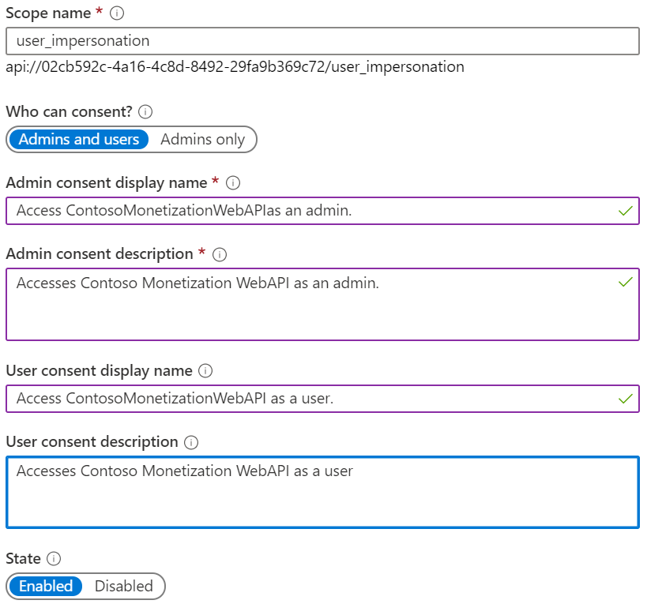
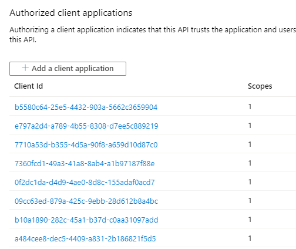
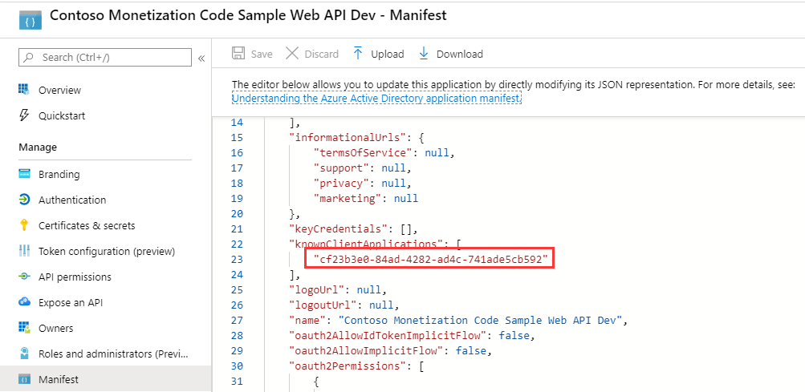

# Create sample web API Azure AD application

1. Sign in to your Azure account through the Azure portal.

1. Click **Azure Active Directory**.

1. Click **App registrations**.

1. Click **New registration**.

1. Name the application **Contoso Monetization Code Sample Web API Dev**. 

1. In the Supported account types section, select **Accounts in any organizational directory (Any Azure AD directory - Multitenant)**.

1. Click **Register**.	

1. Click **API permissions**.

1. Click **Microsoft Graph**.

1. In the search box, enter the **name** of each permission in the list below, then check the **checkbox** next to it, and finally click **Update permissions**.

	**Note:** The following example shows this with the **email** permission.

	

1. Repeat the process until all of the permissions in this list are added.
	
	- email
	- offline_access
	- openid
	- profile
	- User.Read

	
	
1. Click **Grand admin consent for YOUR TENANT NAME**.

1. Click **Yes**.

	When you're finished, the screen will indicate that all permissions have been granted.
	
	
	
1. Click **Expose an API**.

1. Next to **Application ID URI**, click **Set**.

1. Accept the default value and click **Save**.

1. Click **Add a scope**.

1. In the **Scope name** textbox, enter `user_impersonation`.

1. In the **Who can consent** toggle, select **Admins and users**.

1. In the **Admin consent display name** textbox, enter `Access ContosoMonetizationWebAPIas an admin.`.

1. In the **Admin consent description** textbox, enter `Accesses Contoso Monetization WebAPI as an admin.`.

1. In the **User consent display name** textbox, enter `Access ContosoMonetizationWebAPI as a user.`.

1. In the **User consent description** textbox, enter `Accesses Contoso Monetization WebAPI as a user.`.

1. Click **Add scope**.

	
	
1. Click **Add a client application**.

1. In the **Client ID** textbox, enter the ClientID for the App Source Azure AD app you created.

1. Check the **Authorized scopes** checkbox.

1. Click **Add application**.

1. Click **Add a client application**.

1. In the **Client ID** textbox, enter the ClientID for the web app Azure AD app you created.

1. Check the **Authorized scopes** checkbox.

1. Click **Add application**.

1. **Repeat** Steps 29 ~ 32 to add client applications for the add-ins Azure AD apps you created.

   

1. Click **Manifest**.

1. Locate the **knownClientApplications** value in the manifest file.

1. Enter the ClientID for the web app Azure AD app you created.

	

1. Click **Save**.
