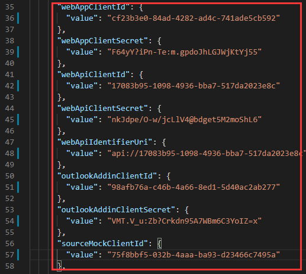
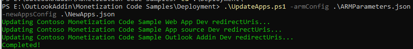

# Installation Guide

## Prerequisites

- Install the following PowerShell modules:
   - [PowerShell 7]( https://github.com/PowerShell/PowerShell/releases/tag/v7.0.0 )
   - [Azure](https://docs.microsoft.com/en-us/powershell/azure/install-az-ps?view=azps-3.1.0)
   - [Microsoft Graph PowerShell SDK](https://github.com/microsoftgraph/msgraph-sdk-powershell)
   - Install [.NET Core 3.0 SDK](https://dotnet.microsoft.com/download/dotnet-core/3.0) and a text editor like Visual Studio 2019 or [Visual Studio Code](https://code.visualstudio.com)
- Azure subscription and an admin account
- Office 365 Tenant and a Global Admin account

## Create the Azure AD applications

This sample uses four Azure Active Directory applications. For instructions for creating the applications, see:

- [Create sample app source Azure AD app](CreateSampleAppSourceAADApp.md)
- [Create sample web app Azure AD app](CreateSampleWebAppAADApp.md)
- Add-ins Azure AD apps:
   - [Create sample Outlook add-in Azure AD app](CreateSampleOutlookAddInAADApp.md) 
   - [Create sample word add-in Azure AD app](CreateSampleWordAddInAADApp.md) 
   - [Create sample Excel add-in Azure AD app](CreateSampleExcelAddInAADApp.md) 
   - [Create sample PowerPoint add-in Azure AD app](CreateSamplePowerPointAddInAADApp.md) 
   - [Create sample Provider-Hosted SharePoint Add-in AAD App](CreateSampleProviderHostedAddInAADApp.md) 
- [Create sample web API Azure AD app](CreateSampleWebAPIAADApp.md) - Create and configure this one after you create the other Azure AD apps. 

## Grant consent for the sample web app Azure AD application

1. Click **Azure Active Directory**.
1. Click **App registrations**.
1. Click the sample web app Azure AD application you created. 
1. Click **Grand admin consent for YOUR TENANT NAME**.
1. Click **Yes**.

When you're finished, the screen will indicate that all permissions have been granted.

## Deploy the ARM template with PowerShell

1. Open the `ARMParameters.json` file and update the following values using the corresponding values from the Azure AD applications you created. These values can be found on the Overview page for each Azure AD application in the Azure portal.

   

2. Update the following parameters with values you choose.
   - webAppSiteName
   - webApiSiteName
   - outlookAddInWebSiteName
   - wordAddInWebSiteName
   - excelAddInWebSiteName
   - powerpointAddInWebSiteName
   - providerHostedAddInWebSiteName
   - resourceMockWebSiteName
   - domainName
   - directoryId
   - sqlAdministratorLogin
- sqlAdministratorLoginPassword
   - sqlMockDatabaseName
   - sqlSampleDatabaseName
   
3. Open PowerShell 7 and run the Powershell command `Connect-AzAccount`.

   

5. Run the script `.\DeployTemplate.ps1`. When prompted, enter the name of the resource group to create.

   

5. Deploy ARM Template successfully.

      

## Compile and deploy the server code

1. In the command line, change to the **.\MonetizationCodeSample** directory.

1. Run the script `.\PublishWebapp.ps1 -armConfig ..\Deployment\ARMParameters.json`. 
   
1. When prompted, enter the same resource group name.
   
1. Deploy code successfully.
   
   

5. According [Provider-Hosted Add-in Web Site Guide ](./AddIns/ProviderHostedWebSiteDeploymentGuide.md) to deploy Provider-hosted add-in web site server code.

## Update Azure AD applications

1. In the command line, change to the **.\Deployment** directory.

1. Run the script `Connect-Graph `

   

1. Run the script `.\UpdateApps.ps1 -armConfig .\ARMParameters.json ` 

   

You now have completed the deployment.

## Install sample add-ins

- [SPFx](./SPFx/DeploymentGuide.md)
- Add-ins:
   -  [Outlook add-in](./AddIns/OutlookAddInDeploymentGuide.md)
   -  [Word add-in](./AddIns/WordAddInDeploymentGuide.md)
   -  [Excel add-in](./AddIns/ExcelAddInDeploymentGuide.md)
   -  [PowerPoint add-in](./AddIns/PowerPointAddInDeploymentGuide.md)
   -  [Provider-Hosted SharePoint add-in](./AddIns/ProviderHostedAddInDeploymentGuide.md)
   -  [SharePoint-Hosted add-in](./AddIns/SharePointHostedAddInDeploymentGuide.md)

## Clean up

If you want to remove all Azure AD applications and sites, you can do the following:

1. Open PowerShell 7 and go to the **.\Deployment** directory.
2. Run the Powershell command `Remove-AzResourceGroup -name <resource group name>` and pay attention to replacing **&lt;resource group name&gt;** with your resource group name.
3. Go to the **.\Deployment** directory.
4. Run the script `.\RemoveApps.ps1 -config .\NewApps.json`.