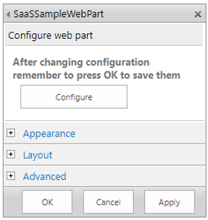
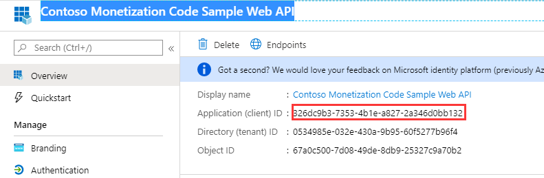
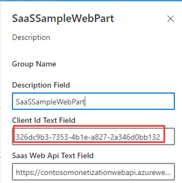
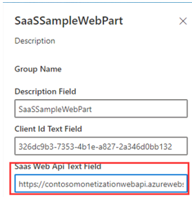

# Monetization SPFx Add-in

# Installation

1.  Download the SPFx Add-in [**saas-sample-web-part.sppkg**](saas-sample-web-part.sppkg) package file.

2.   Open your SharePoint Catalog then upload the SPFx package file.

   

3. Select the **checkbox** and click **Deploy**.

   

4. Select the **saas-sample-web-part** file, then click **Sync to Teams** in the Ribbon menu.

   

5. Go to the SharePoint Admin Center.

6. Open the **API management** and approve the following two permissions.

   

7. Successfully approved.

   

8. Open a SharePoint site page and edit the page.

9. Add the SaaSSampleWebPart to the page.

   

10. Edit the web part, and click **Configure**.

   

11. Copy Contoso Monetization Code Sample Web API Client Id and paste it into the web part.

    

    

12. Copy Contoso Monetization Code Sample Web API URL

    

13. Replace the WebAPI URL copied above, then paste it into the SaaS Web API Text Field.  The following example shows how to replace it.

    [**https://YOURContosoMonetizationCodeSampleWebAPIURL**/api/Subscriptions/CheckOrActivateLicense/contoso_o365_addin](https://YOURContosoMonetizationCodeSampleWebAPIURL/api/Subscriptions/CheckOrActivateLicense/contoso_o365_addin)

    

14. Save the configuration and stop editing the page.

15. Observe the license status in the web part.

    
