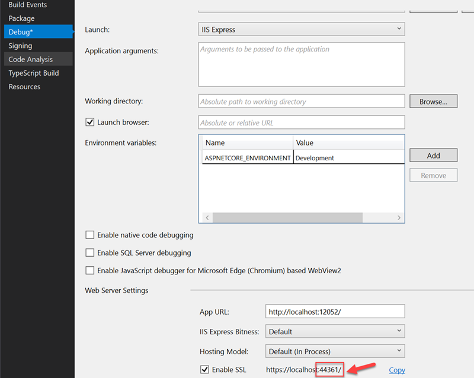
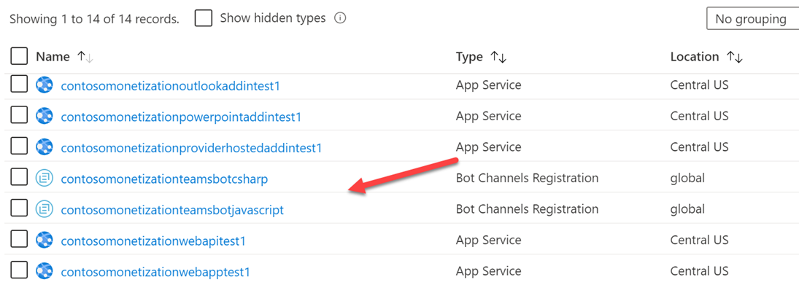
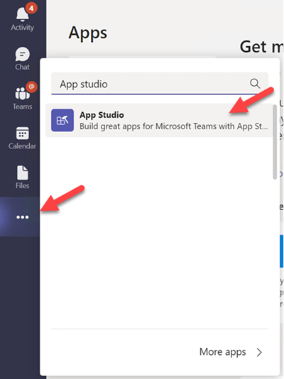
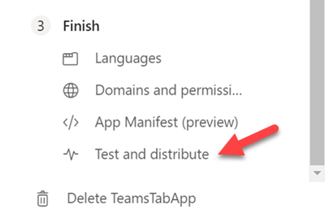

# Monetization Sample Teams Bot(C#) App

## Establish a secure tunnel to your Bot

- Open the project [TeamsBotinCSharp.csproj](../../MonetizationCodeSample/TeamsBotinCSharp/TeamsBotinCSharp.csproj) with Visual Studio 2019.

- Right click to select **Property** of the project [TeamsBotinCSharp.csproj](../../MonetizationCodeSample/TeamsBotinCSharp/TeamsBotinCSharp.csproj), and then click **Deubg** in left menu list, record this port number and will use it in the next steps.

    

- Open a command prompt in the root of your project directory and run the following command:

>**Note**: Need to replace the **&lt;port&gt;** the following command with your localhost port number in Visual Stduio 2019.

    ```command
    ngrok http https://localhost:<port> -host-header="localhost:<port>"
    ```

- Ngrok will listen to requests from the Internet and will route them to your application when it is running on port 44374. It should resemble 'https://abc123.ngrok.io/' where abc123 is replaced by your ngrok alpha-numeric subdomain URL.

## Update Bot Channels Registration

1. Go to the resource group you created in the **Azure Portal**.

1. Click the **Bot Channels Registration** for the **Contoso Monetization Teams Bot(C#)**.

    

1. Click **Configuration** button under **Settings** section on the left.

1. In **Messaging endpoint** field, replace the **BOTAPICSHARPURL** with the ngrok generated subdomain name.

1. Click **Apply**

## Upload your Bot to Teams with App Studio

- In Visual Studio 2019, Press **F5** to start the app.

- Open the Microsoft Teams client.

- Open App studio and select the **Manifest editor** tab.

  

- Select the **Import an existing app** tile in the Manifest editor to upload the [manifest.json](../../MonetizationCodeSample/TeamsBotinCSharp/AppManifest/manifest.json) file.

- Open the uploaded **MonetizationTeamBot** app in the **Test and distribute** section:

  

  1. Select **Install**.

  1. Click the **Add** button and Teams will open a chat window.

  1. Enter "Log in" to sign in with your account and view the license status.
