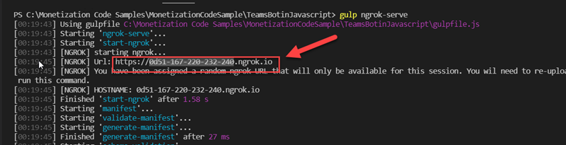

# Monetization Sample Teams Bot (JavaScript) App

## Update code

- Open the [TeamsBotinJavascript](../../MonetizationCodeSample/TeamsBotinJavascript/) folder with Visual Studio Code.

- Open **.env**, and then replace the placeholders with the appropriate values.

    ```command
    # App Id and App Password for the Bot Framework bot
    MICROSOFT_APP_ID=<TEAMSBOTJAVASCRIPTAADCLIENTID>
    MICROSOFT_APP_PASSWORD=<TEAMSBOTJAVASCRIPTAADSECRET>

    # Saas Web API Url
    SAAS_API=https://<SAASWEBAPISITEURL>.azurewebsites.net/api/Subscriptions/CheckOrActivateLicense/contoso_o365_addin
    ```

- Open **AppManifest/manifest.json**, and then replace the placeholders with the appropriate values.

    ```json
    "bots": [
        {
            "botId": "<TEAMSBOTJAVASCRIPTAADCLIENTID>",
            "scopes": [
                "personal"
            ],
            "supportsFiles": false,
            "isNotificationOnly": false
        }
    ],
    ```

- **Save** all files.

## Start the Teams Bot service for testing

- Open the [TeamsBotinJavascript](../../MonetizationCodeSample/TeamsBotinJavascript/) folder with Visual Studio Code.
- Open a new Terminal and then run the following command:

    ```command
        npm install
        gulp ngrok-serve
    ```

  Copy the ngrok URL displayed in the console. This value is used in the next step.

## Update Bot Channels Registration

1. Go to resource group you created in the **Azure Portal**.

1. Click the **Bot Channels Registration** for the **Contoso Monetization Teams Bot(JavaScript)**.

    

1. Click **Configuration** button under **Settings** section on the left.

1. In **Messaging endpoint** field, replace the **BOTAPIJAVASCRIPTURL** with the ngrok generated subdomain name.

    

1. Click **Apply**

## Upload your tab to Teams with App Studio

- Open the Microsoft Teams client.

- Open App studio and select the the **Manifest editor** tab.

  

- Select the **Import an existing app** tile in the Manifest editor to upload the [manifest.json](../../MonetizationCodeSample/TeamsBotinJavascript/AppManifest/manifest.json) file.

- Open the uploaded **MonetizationTeamBotJs** app in the **Test and distribute** section:

    

  1. Click the **Install** button.

  1. Click the **Add** button and Teams will open a chat window.
  
  1. Enter "Log in" to sign in with your account and then view the license status.
