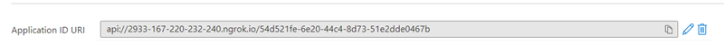
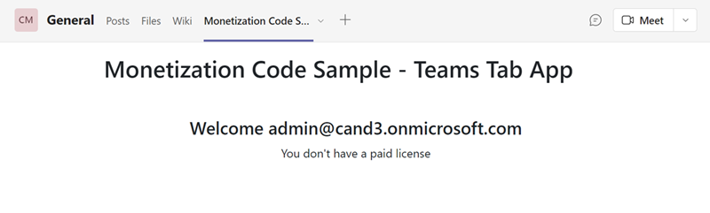
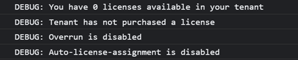

# Monetization Sample Teams Tab App

## Establish a secure tunnel to your tab and update manifest.json

- Open the project [TeamsTabApp.csproj](../../MonetizationCodeSample/TeamsTabApp/TeamsTabApp.csproj) with Visual Studio 2019.

- Right click to select **Property** of the project [TeamsTabApp.csproj](../../MonetizationCodeSample/TeamsTabApp/TeamsTabApp.csproj), and then click **Debug** in left menu list, record this port number and will use it in the next steps.

    

- Open a command prompt in the root of your project directory and run the following command:
    >**Note**: Need to replace the **&lt;port&gt;** the following command with the above localhost port number.

    ```command
    ngrok http https://localhost:<port> -host-header="localhost:<port>"
    ```

    >Ngrok will listen to requests from the Internet and will route them to your application when it is running. It should resemble a URL like this, 'https://abc123.ngrok.io/', where abc123 is replaced by your ngrok alpha-numeric subdomain URL.

- Open **AppManifest/manifest.json**, and then replace the placeholders with the appropriate values.

    ```json
    "configurableTabs": [
        {
        "configurationUrl": "https://<the-subdomain-generated-by-NGROK-in-the-previous-step>.ngrok.io/tab",
        "canUpdateConfiguration": true,
        "scopes": [
            "team",
            "groupchat"
        ]
        }
    ]
    ...
    "webApplicationInfo": {
        "id": "<TeamsTabAadClientId>",
        "resource": "api://<the-subdomain-generated-by-NGROK-in-the-previous-step>.ngrok.io/<TeamsTabAadClientId>"
    }
    ```

## Update the sample Teams Tab App Azure AD application

- Open the **Contoso Monetization Code Sample Teams Tab App** in the [App registrations](https://go.microsoft.com/fwlink/?linkid=2083908) page.

- In the **Expose an API** section, update the api://<mark>fully-qualified-domain-name.com</mark>/{AppID} with your ngrok subdomain name.

  

- Save the changes.

## Upload your tab to Teams with App Studio

- In Visual Studio 2019, Press **F5** to start the app.

- Open the Microsoft Teams client.

- Open **App studio** and select the **Manifest editor** tab.

  

- Select the **Import an existing app** tile in the Manifest editor to upload the [manifest.json](../../MonetizationCodeSample/TeamsTabApp/AppManifest/manifest.json) file.

- Open the uploaded **TeamsTabApp** app, then open the **Test and distribute** section:

  

  1. Select **Install**.

  1. In the pop-up window **Add to a team or chat** field, enter your team and then click **Set up a tab**.
  
  1. In the next pop-up window click the **Save** button.

## View in Microsoft Teams online

1. Open [Teams](https://teams.microsoft.com/_#/conversations/General) with a web browser.

1. Sign in and then click team where you just installed the **Contoso Monetization Code Sample Teams Tab App**.

1. Click the **Contoso Monetization Code Sample Teams Tab App** tab.

1. View the license status.

    

1. Open the browser Developer console (F12), to view the DEBUG logs.

    
