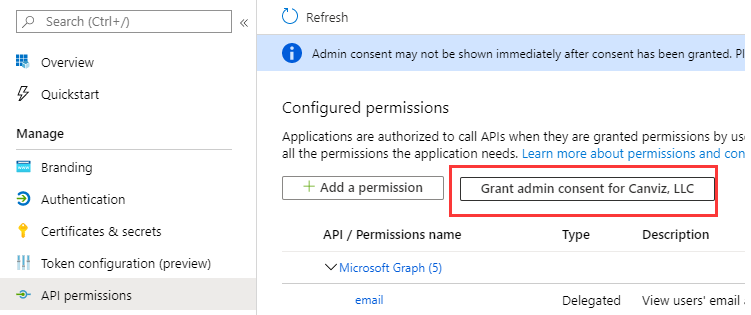
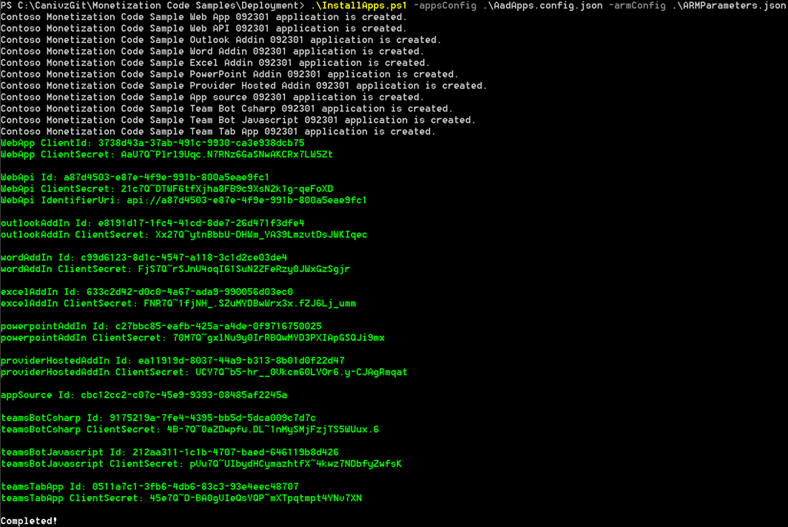
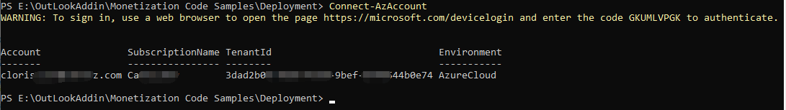
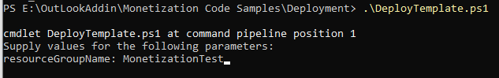
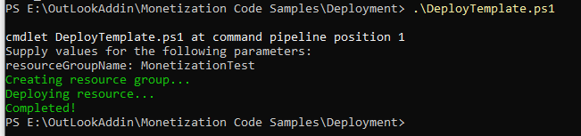
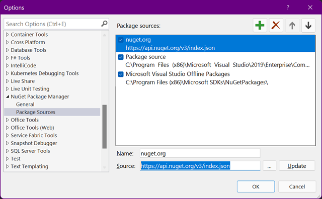
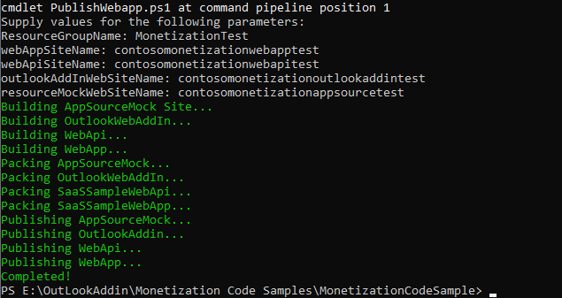

# Installation Guide

## Prerequisites

- Install [PowerShell 7](https://github.com/PowerShell/PowerShell/releases/tag/v7.1.4)
- Install the following PowerShell modules:
  - [Microsoft Graph PowerShell SDK](https://github.com/microsoftgraph/msgraph-sdk-powershell#powershell-gallery)

      ``` command
      Install-Module Microsoft.Graph -AllowClobber -Force
      ```

  - [Azure Az PowerShell module](https://docs.microsoft.com/en-us/powershell/azure/install-az-ps?view=azps-6.4.0#installation)

      ``` command
      Install-Module -Name Az -Scope CurrentUser -Repository PSGallery -AllowClobber -Force 
      ```
  
- [Visual Studio 2019](https://visualstudio.microsoft.com/vs/)
   >**Note:** use **Visual Studio Installer** to install the following development toolsets:
  - ASP.NET and web development
  - Azure development
  - Office/SharePoint development
  - .NET cross-platform development
- [Visual Studio Code](https://code.visualstudio.com)
- Install [.NET Framework 4.8 Developer Pack](https://dotnet.microsoft.com/download/dotnet-framework/thank-you/net48-developer-pack-offline-installer)
- Install [.NET Core 3.1 SDK](https://dotnet.microsoft.com/download/dotnet/3.1)
- Install [Microsoft Teams for work or school](https://www.microsoft.com/en-us/microsoft-teams/download-app)
- Install [Node.js v14.18.1](https://nodejs.org/download/release/v14.18.1/)
- Install [gulp-cli](https://www.npmjs.com/package/gulp-cli)

   ``` command
   npm install gulp-cli --global
   ```

- Download and setup [ngrok](https://dashboard.ngrok.com/get-started/setup)
- Azure subscription and an admin account
- Office 365 Tenant and a Global Admin account

## Configure ARM Parameters

1. Open the `ARMParameters.json` file and update the following parameters with values you choose.
   > **Note:** a. You need to make sure enter a unique name for each web app and web site in the parameter list shown below because the script will create many Azure web apps and sites and each one must have a unique name.  All of the parameters that correspond to web apps and sites in the following list end in **SiteName**.
   b. For domainName and directoryId, please refer to this [article](https://docs.microsoft.com/en-us/partner-center/find-ids-and-domain-names#find-the-microsoft-azure-ad-tenant-id-and-primary-domain-name) to find your Microsoft Azure AD tenant ID and primary domain name.

    - webAppSiteName
    - webApiSiteName
    - resourceMockWebSiteName
    - domainName
    - directoryId (Directory (tenant) ID)
    - sqlAdministratorLogin
    - sqlAdministratorLoginPassword
    - sqlMockDatabaseName
    - sqlSampleDatabaseName

## Create the Azure AD applications

This sample uses three Azure Active Directory applications.

- Contoso Monetization Code Sample Web App
- Contoso Monetization Code Sample Web API
- Contoso Monetization Code Sample App source

1. In a Powershell 7 window, change to the **.\Deployment_SaaS_Resources** directory.

1. In the same window run `Connect-Graph -Scopes "Application.ReadWrite.All, Directory.AccessAsUser.All DelegatedPermissionGrant.ReadWrite.All Directory.ReadWrite.All"`

1. Click **Accept**.

   

1. In the same window run `.\InstallApps.ps1`

1. Create and configure Azure AD apps successfully.

   

1. Copy the values from the output and later you will need some of these values to update the code and config file for deploying Add-ins.

## Deploy the ARM template with PowerShell

1. Open PowerShell 7 and run the Powershell command `Connect-AzAccount`.

   

1. Run the script `.\DeployTemplate.ps1`. When prompted, enter the name of the resource group to create.

   

1. Deploy ARM Template successfully.

   

## Compile and deploy the server code

  >**Note:** Please make sure that the default NuGet package source **https://api.nuget.org/v3/index.json** is correctly added in Visual Studio 2019.

  

1. In the command line, change to the **.\MonetizationCodeSample** directory.

1. Run the script `.\PublishSaaSApps.ps1`.

1. When prompted, enter the same resource group name.

1. Deploy code successfully.

    >**Note:** You may see some warnings about file expiration, please ignore.

   

## Clean up

If you want to remove all Azure AD applications and sites, you can do the following:

1. Open PowerShell 7 and go to the **.\Deployment_SaaS_Resources** directory.
1. Run the Powershell command `Remove-AzResourceGroup -name <resource group name>` and pay attention to replacing **&lt;resource group name&gt;** with your resource group name.
1. Go to the **.\Deployment_SaaS_Resources** directory.
1. Run the script `.\RemoveApps.ps1`.
