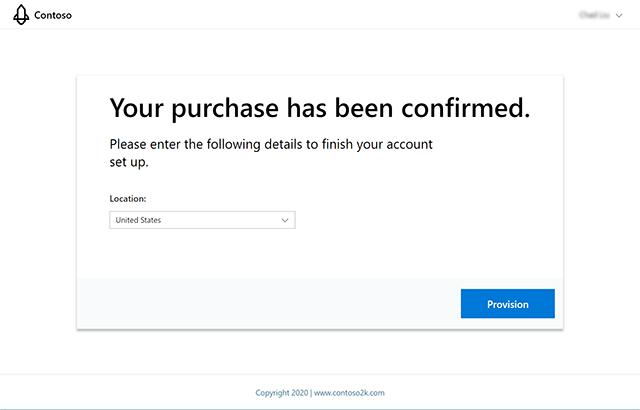
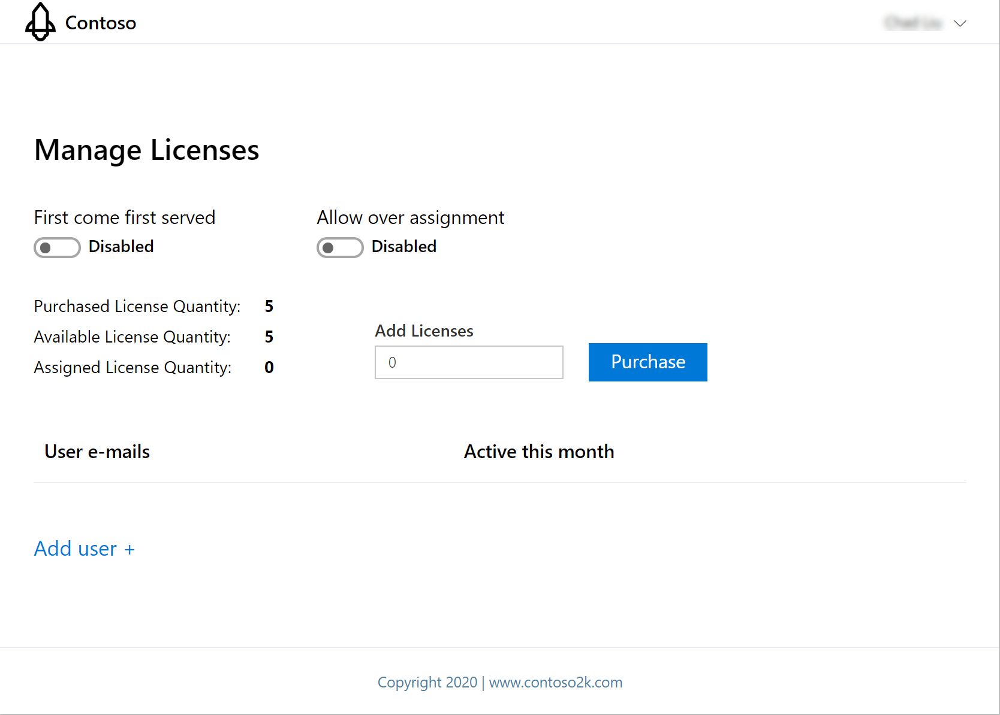

# Introduction 
This code sample demonstrates how Microsoft ISVs can create a simple license management system to manage add-ins sold in Microsoft AppSource.

# Installation and Configuration
Follow the instructions in the deployment guides to install and configure the sample.

1. [Sample Deployment Guide](/Deployment/DeploymentGuide.MD)
2. [SPFx add-in Deployment Guide](/Deployment/SPFx/DeploymentGuide.md)
3. [Outlook add-in Deployment Guide](/Deployment/AddIn/DeploymentGuide.md)

# Testing
Follow the instructions in the test guide to test the different use cases.

1. [Test Guide](/Test/TestGuide.md)

# Inventory
This section links to the various README files associated with the projects included in the sample.  Read the README files for more information about each project.

- [AppSourceMockWebApp](/MonetizationCodeSample/AppSourceMockWebApp/README.md)
- [Microsoft.Identity.Web](/MonetizationCodeSample/Microsoft.Identity.Web/README.md)
- [MockAppData](/MonetizationCodeSample/MockAppData/README.md)
- [OutlookWebAddIn](/MonetizationCodeSample/OutlookWebAddIn/README.md)
- [OutlookWebAddInWeb](/MonetizationCodeSample/OutlookWebAddInWeb/README.md)
- [SaaSSampleWebApi](/MonetizationCodeSample/SaaSSampleWebApi/README.md)
- [SaaSSampleWebApp](/MonetizationCodeSample/AppSourceMockWebApp/README.md)
- [SPFXAddIn](/MonetizationCodeSample/SPFXAddIn/README.md)

# Appendix

## UX / API Mapping

This matrix describes the user interface actions and how they correlate to different API calls.

| User interface where the API is invoked  | API Call                                                                                                                                                                                                                                                                                                                                                                    | Mock API Exists | Mock API Works | Can we test the Mock API without the offer being published to the public? | Can we test the Production API without the offer being published to the public? |
|------------------------------------------|-----------------------------------------------------------------------------------------------------------------------------------------------------------------------------------------------------------------------------------------------------------------------------------------------------------------------------------------------------------------------------|-----------------|----------------|---------------------------------------------------------------------------|---------------------------------------------------------------------------------|
|      | Resolve a subscription in purchase process:   HttpPost  https://marketplaceapi.microsoft.com/api/saas/subscriptions/resolve?api-version=2018-09-15                                                                                                                                                                                                              | Yes             | Yes            | Yes                                                                       | No                                                                              |
|      | Activate a subscription in purchase process:  HttpPost  https://marketplaceapi.microsoft.com/api/saas/subscriptions/0aa95e32-8be7-4e5e-94f9-563f6d7d9dcd/activate?api-version=2018-09-15                                                                                                                                                                        | Yes             | Yes            | Yes                                                                       | No                                                                              |
|      | Update the quantity on the subscription in plan/quantity changed process  HttpPatch  https://marketplaceapi.microsoft.com/api/saas/subscriptions/0aa95e32-8be7-4e5e-94f9-563f6d7d9dcd?api-version=2018-09-15    Note: Although the patch request works, but actually the test data will not be updated, and the web hook will not be triggered as well. | Yes             | Yes            | No                                                                        | No                                                                              |
|      | Update the status of an operation in plan/quantity changed process  HttpPatch  https://marketplaceapi.microsoft.com/api/saas/subscriptions/0aa95e32-8be7-4e5e-94f9-563f6d7d9dcd/operations/7688ae05-1579-4fdd-be89-12b45f0a4ef3?api-version=2018-09-15                                                                                                          | Yes             | Yes            | No                                                                        | No                                                                              |
|      | Query operations in plan/quantity changed process  HttpPatch  https://marketplaceapi.microsoft.com/api/saas/subscriptions/0aa95e32-8be7-4e5e-94f9-563f6d7d9dcd/operations?api-version=2018-09-15                                                                                                                                                                | Yes             | Yes            | Yes                                                                       | No                                                                              |
|      | Webhook on the SaaS service                                                                                                                                                                                                                                                                                                                                                 | No              | No             | No                                                                        | No                                                                              |

# Copyright

Copyright (c) 2020 Microsoft Corporation. All rights reserved.
