# Test Guide for Monetization Code Sample

In the sample we created a mock AppSource web site to demonstrate all the processes.  It will help you understand the SaaS Fulfillment APIs, and you don't need to apply for a real SaaS offer.

In this monetization model, your add-in is authenticated by your SaaS offering, which verifies its subscription status with the Microsoft SaaS service. Your responses from this service are used to update your user database. The following diagram illustrates this model.

## New Monetization Model

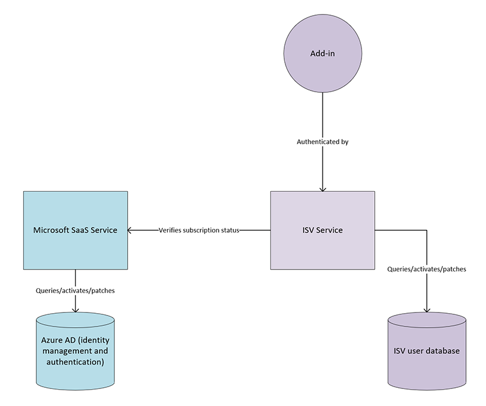

## Prerequisites

1. Please make sure to prepare a test tenant and three test accounts to complete the whole process. One of the accounts needs to be a **Tenant Admin**. You can create test tenants with the [Developer program](https://developer.microsoft.com/en-us/microsoft-365/dev-program) and you can automatically stand up fake users with the [User data pack](https://docs.microsoft.com/en-us/office/developer-program/install-sample-packs).

2. Please refer the deployment guide to deploy the Monetization Code Sample solution to your Azure environment. Deployment includes three web apps and one Office Outlook add-in.

> **Note:** Use your tenant admin account to perform the following test steps.  The other two test accounts are used to run Outlook add-in and the instructions will let you know when to use those accounts.

## Provisioning (Customer purchase of a Site Based License on Microsoft AppSource)

This diagram describes how the SaaS fulfillment APIs are invoked.

1. Navigate to the mock AppSource web site.

   e.g. 'https://contosomonetizationappsource.azurewebsites.net/'

> **Note:** When you first visit the web site, it will prompt you with the **Permissions requested** popup box.  Please make sure **Consent on behalf of your organization** checked and then click the **Accept** button.

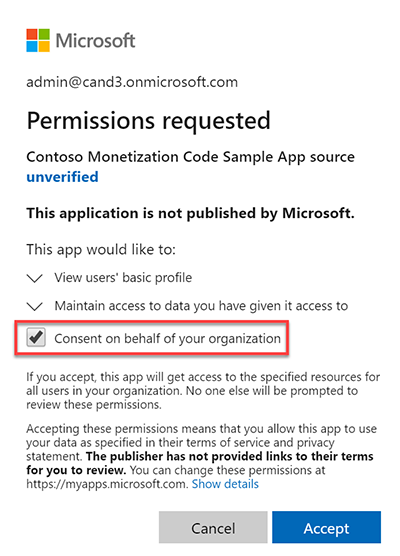

1. On the home page, click the **Purchase** button to purchase an Office 365 Outlook Add-in.

1. Select **SiteBasedPlan** in the License Type field, and then click the **Purchase** button.

1. As a customer, you will be redirected to ISV service web site, please select your location, and then click the **Provision** button.

> **Note:** When you first visit the web site, it will prompt you with the **Permissions requested** popup box.  Please make sure **Consent on behalf of your organization** checked and then click the **Accept** button.

1. After the provisioning is complete, you will be redirected to home page of the ISV service web site.

   

1. Open the **Office Outlook add-in** and sign in, you will see **You do have a paid license** text in the add-in.

   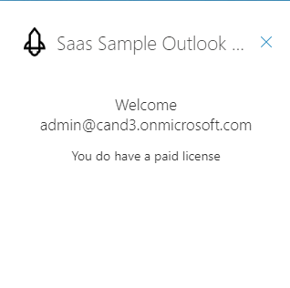

   Open the developer tools in your web browser to see the debug logs.

   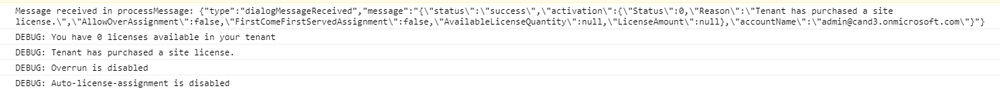

1. Close the **Office Outlook add-in**, and switch back to your browser.
1. Repeat steps 6 and 7 for  **other Office add-ins and SPFx web part**.

## Service initiated update (Customer goes to AppSource and converts their Site Based License to a Seat Based License)

This diagram describes how the SaaS fulfillment APIs are invoked.

1. Click the logo in the upper left corner of page, to go to the home page.

1. Click the **Purchase/Cancel license** button, and you will be taken to the **License management** page.

1. Click the **Go to AppSource to change plan** link, and then you will be taken to the mock AppSource web site.

1. Select **SeatBasedPlan** in the **License Type** field, enter **1** in the **Quality** field, and then click the **Update Subscription** button.

   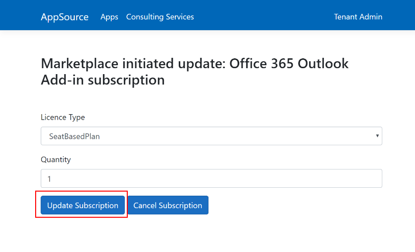

1. After the plan is updated, open the **Office Outlook add-in** and sign in, you will see the **You don't have a paid license** text in the add-in.

   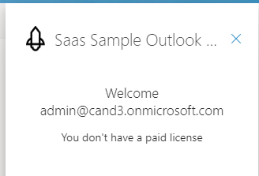

   Open the developer tools in your web browser to see the debug logs.

   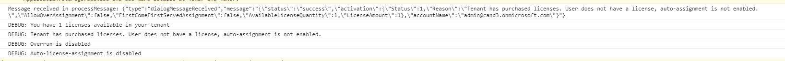

   Open the **Other Office add-ins and SPFx web part** to see the same behavior.

1. Switch to your web browser, and go to home page of the ISV service web site.  Then click the **Purchase/Cancel license** button.

   >**Note:** You can click **Manage Users** to add organization users to manage or view license assignments.

1. In the license management page, click the **Add user +** button.  A pop-up box will appear.  Enter the email address you used to purchase and test the add-ins with, then click the **Assign** button.

   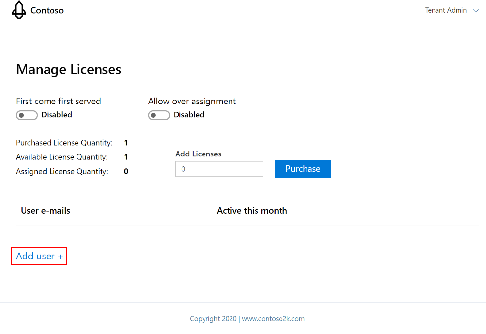

   After the email is assigned sucessfully, the email will be listed in the table below.

   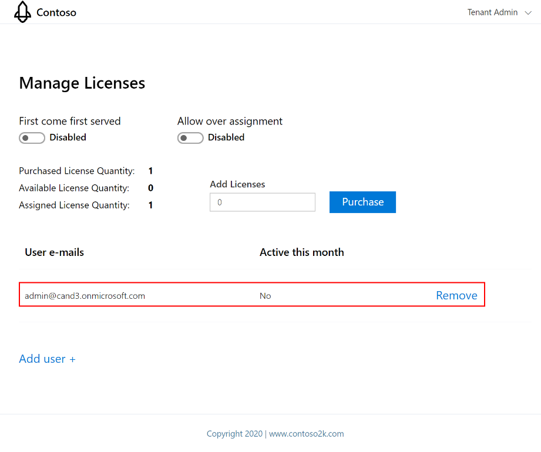

1. Open the **Teams tab app** and sign in, you will see the **You do have a paid license** text in the app.

   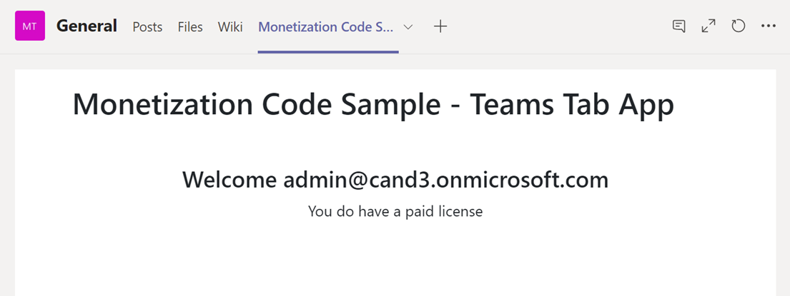

   Open the developer tools in your web browser to see the debug logs.

   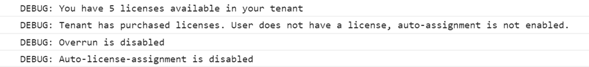
